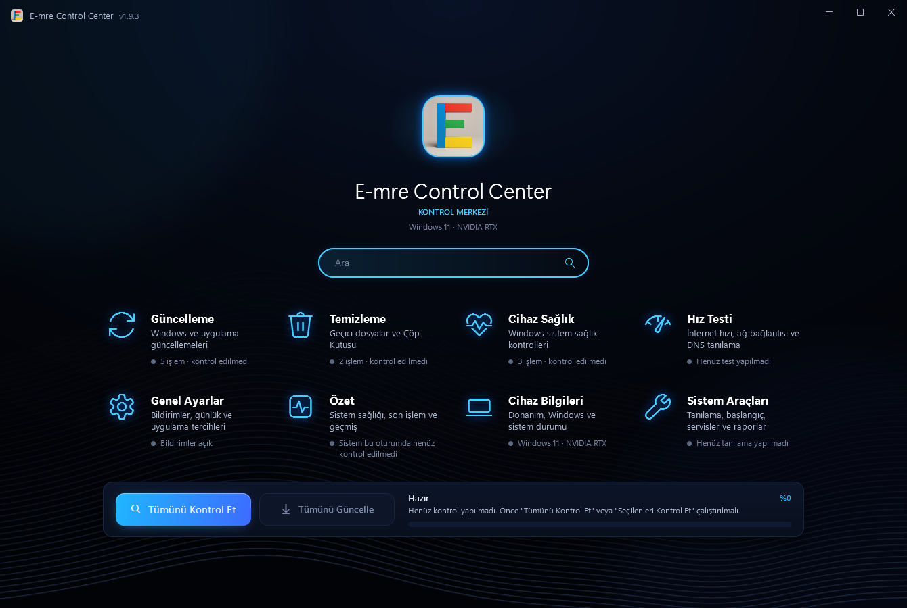
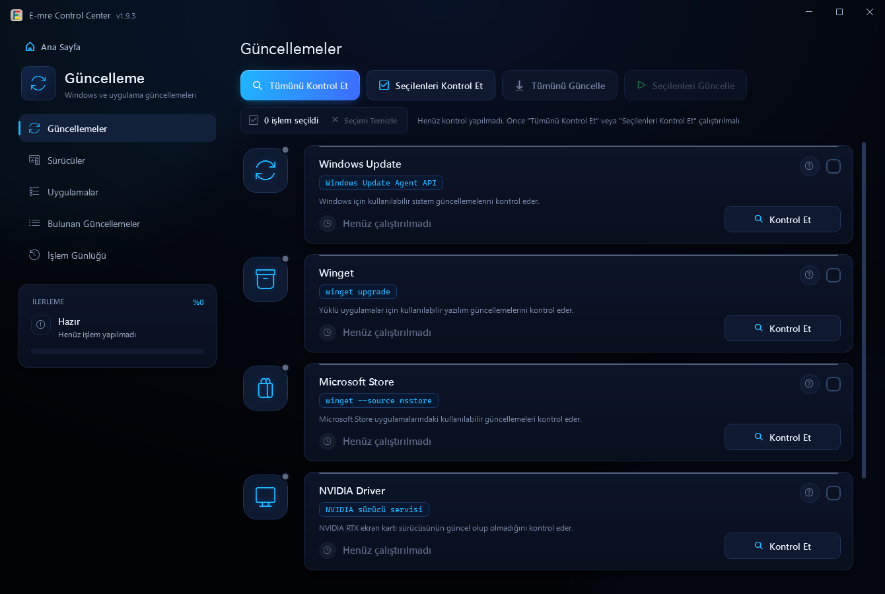
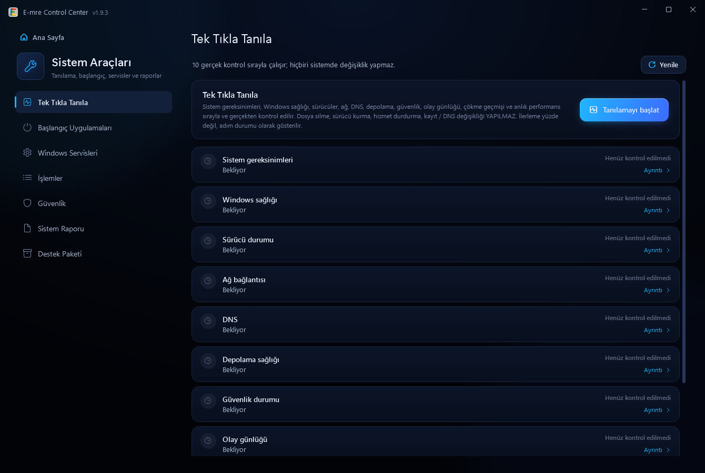

<div align="center">


# E-mre Control Center

**Windows 11 bilgisayarınızın güncelleme, temizlik, onarım ve sağlık kontrolünü tek ekrandan yapın.**

Onayınız olmadan hiçbir şey kurmaz, silmez veya değiştirmez. Gösterdiği her sonuç Windows'un kendi araçlarından gelir.

[](https://github.com/E-mre-Hub/E-mre-Control-Center/releases/latest)
[](https://github.com/E-mre-Hub/E-mre-Control-Center/releases)
[](#gereksinimler)
[](https://dotnet.microsoft.com/)

**[İndir](https://github.com/E-mre-Hub/E-mre-Control-Center/releases/latest)** ·
[Özellikler](#neler-yapar) · [Kurulum](#kurulum) · [Sık sorulan sorular](#sık-sorulan-sorular) · [Gizlilik](#gizlilik) ·
[English](#english)



</div>

---

## Neden E-mre Control Center?

Bilgisayar bakımı için ayrı ayrı programlarla uğraşmak yerine her şey tek yerde: **Tümünü Kontrol Et** dersiniz, uygulama neyin
güncellenebileceğini, neyin temizlenebileceğini ve sistemde bir sorun olup olmadığını listeler. Onaylarsanız uygular.

- **Önce sorar.** Program kurma, dosya silme, onarım gibi değişiklik yapan her işlem sizin onayınızla başlar.
- **Gerçek sonuç gösterir.** "Bilgisayarınız %80 hızlandı" gibi uydurma değerler yoktur. Başarısız olan işlem başarısız görünür,
  nedeniyle birlikte.
- **Güvenlidir.** Windows'un güvenlik sorusunu (UAC) atlatmaz; kişisel dosyalarınıza ve kritik Windows bileşenlerine dokunmaz.
- **Kendini günceller.** Yeni sürüm çıkınca uygulamanın içinde bildirim gelir; tek tıkla güncellenir.

## Neler yapar?

| | |
|---|---|
| **Güncelleme** | Windows Update · uygulamalar (winget) · Microsoft Store · NVIDIA sürücüsü (resmi NVIDIA kaynağından) · Microsoft Defender tanımları · Microsoft Edge |
| **Temizlik** | Geçici dosyalar · Windows geçici dosyaları · Teslim En İyileştirme önbelleği · hata raporları · DirectX önbelleği · Çöp Kutusu |
| **Onarım** | Sistem dosyası denetimi (SFC) · Windows görüntü onarımı (DISM) · Microsoft Kötü Amaçlı Yazılım Temizleme Aracı (hızlı tarama) |
| **Tanılama** | Tek Tıkla Tanıla · sürücüler · olay günlüğü · çökme analizi · başlangıç uygulamaları · Windows servisleri · çalışan işlemler · güvenlik durumu · sistem raporu (TXT, HTML, JSON) · destek paketi |
| **Cihaz** | İşlemci, ekran kartı, bellek ve disk bilgileri · canlı performans · disk ve batarya sağlığı |
| **İnternet** | Hız testi (Cloudflare veya Speedtest by Ookla): indirme, yükleme, ping, paket kaybı ve geçmiş · ağ ve DNS tanılama |

<table>
  <tr>
    <td width="50%"></td>
    <td width="50%"></td>
  </tr>
  <tr>
    <td align="center">Güncellemeler: her bileşen ayrı kartta, gerçek durumuyla</td>
    <td align="center">Tek Tıkla Tanıla: sistemde değişiklik yapmadan genel kontrol</td>
  </tr>
</table>

## Kurulum

1. **[Son sürüm sayfasından](https://github.com/E-mre-Hub/E-mre-Control-Center/releases/latest)**
   `E-mre-Control-Center-Setup-vX.Y.Z.exe` dosyasını indirin. GitHub hesabı gerekmez.
2. Dosyayı çalıştırın ve **Yükle**'ye basın. Windows izin isterse **Evet** deyin.
3. İlk açılışta gereksinim ekranındaki kutuyu işaretleyip **Devam Et**'e basın.

Hepsi bu. Uygulama Başlat menüsünde (ve isterseniz masaüstünde) yer alır; yeni sürümler uygulamanın içinden gelir.

> **"Windows kişisel bilgisayarınızı korudu" uyarısı çıkarsa:** uygulama henüz bir kod imzalama sertifikasıyla imzalanmadığı için
> Windows bu uyarıyı gösterir. **Ek bilgi → Yine de çalıştır** ile devam edebilirsiniz. Aynı nedenle izin penceresinde yayıncı
> "Bilinmeyen" görünür. Uygulamanın kaynak kodu bu depoda herkese açıktır.

**Kurmadan kullanmak için:** aynı sayfadaki `E-mre-Control-Center-vX.Y.Z.zip` dosyasını indirip açın ve
`E-mre Control Center.exe` dosyasını çalıştırın.

**Kaldırmak için:** Windows Ayarlar → Uygulamalar → Yüklü uygulamalar → E-mre Control Center → Kaldır.

## Nasıl kullanılır?

1. **Tümünü Kontrol Et.** Uygulama güncellemeleri, temizlenebilir alanı ve sistemin sağlığını kontrol eder. Bu adımda hiçbir şey
   değiştirilmez.
2. **Sonuçlara bakın.** Her kart gerçek durumunu gösterir; **Detaylı Sonuç** çalıştırılan komutu, çıkış kodunu ve çıktısını açar.
3. **Tümünü Güncelle** ya da yalnızca seçtiğiniz kartları çalıştırın. Değişiklik yapan her işlem önce onay ister ve işlem sürerken
   hangi adımda olduğu (ör. "Winget: 5/7 · Visual Studio Code: indiriliyor") ekranda görünür.

## Gereksinimler

| | |
|---|---|
| **İşletim sistemi** | Windows 11 (derleme 22000 ve üzeri) |
| **İnternet** | Gerekli. Bağlantı yoksa uygulama açılmaz; kullanırken bağlantı giderse bağlantı gelene kadar beklemeye geçer. |
| **Yönetici izni** | Kontrol, güncelleme ve onarım işlemleri için gerekli. İzin vermezseniz hız testi, cihaz bilgileri ve arama yine kullanılabilir. |
| **NVIDIA RTX ekran kartı** | İsteğe bağlı. Yoksa **Kartsız Devam Et** ile girilir; yalnızca NVIDIA sürücüsü kartı kapanır. |
| **.NET** | Gerekmez; uygulamanın içinde gelir. |
| **Arayüz dili** | Türkçe |

## Güvenlik

**E-mre Control Center şunları yapmaz:**

- Onayınız olmadan program kurmaz veya kaldırmaz, dosya silmez, ayar değiştirmez.
- Windows'un güvenlik sorusunu (UAC) atlatmaz; yönetici izni yalnızca Windows'un kendi izin penceresiyle alınır.
- Belgeler, İndirilenler gibi kişisel klasörlere ve Windows.old'a dokunmaz; kullanımdaki dosyaları silmeye çalışmaz.
- Windows servislerini, Gezgin'i ve kritik sistem işlemlerini kapatmaz; Defender ve güvenlik duvarı ayarlarını değiştirmez.

**Bunun yerine:**

- İndirdiği kurulum dosyalarını çalıştırmadan önce doğrular (NVIDIA sürücüsünde NVIDIA dijital imzası, uygulama güncellemesinde
  SHA-256 özeti ve sürüm).
- İşlem bittikten sonra sonucu sistemden yeniden okur; doğrulayamadığı sonucu "başarılı" göstermez.
- Her işlemin ayrıntısını günlüğe yazar. Günlükler bilgisayarınızda kalır.

Güvenlik tasarımının ayrıntıları için: [Teknik belge](docs/TEKNIK.md).

## Gizlilik

- Hesap istemez. **Telemetri, analitik, reklam ve çerez yoktur.**
- Ayarlar, işlem geçmişi ve günlükler yalnızca bilgisayarınızda saklanır: `%LOCALAPPDATA%\E-mre Control Center`
- Uygulamanın bağlandığı hizmetler (GitHub, Microsoft, NVIDIA, Cloudflare; isteğe bağlı Speedtest by Ookla ve Google Forms) ve hangi
  bilginin gönderildiği gizlilik politikasında tek tek yazılıdır.

| Belge | Türkçe | English |
|---|---|---|
| Gizlilik Politikası | [Oku](legal/tr/gizlilik-politikasi.md) | [Read](legal/en/privacy-policy.md) |
| Kullanım Koşulları | [Oku](legal/tr/kullanim-kosullari.md) | [Read](legal/en/terms-of-use.md) |

## Sık sorulan sorular

<details>
<summary><b>Ücretsiz mi?</b></summary>

Evet. Hesap, abonelik veya reklam yoktur.
</details>

<details>
<summary><b>Bilgisayarıma zarar verir mi?</b></summary>

Değişiklik yapan her işlem önce onayınızı ister ve Windows'un kendi araçlarıyla (Windows Update, winget, SFC, DISM vb.) yapılır.
Kurulum ve onarım işlemleri yarıda kesilmez. Yine de büyük güncellemelerden önce önemli dosyalarınızı yedeklemeniz iyi bir alışkanlıktır.
</details>

<details>
<summary><b>Neden yönetici izni istiyor?</b></summary>

Windows; güncelleme kurma, sürücü yükleme ve sistem dosyası onarımı gibi işlemlere yalnızca yönetici izniyle izin verir. İzin
Windows'un kendi penceresiyle istenir. Vermezseniz uygulama açılır ama bu işlemler kapalı kalır.
</details>

<details>
<summary><b>NVIDIA ekran kartım yok, kullanabilir miyim?</b></summary>

Evet. Gereksinim ekranında **Kartsız Devam Et**'i seçin. Yalnızca NVIDIA sürücü güncellemesi kapanır; diğer her şey çalışır.
</details>

<details>
<summary><b>Yeni sürümler nasıl gelir?</b></summary>

Yeni sürüm yayınlanınca uygulamanın içinde "Yeni sürüm yayınlandı" penceresi açılır; **Güncelle**'ye basmanız yeterlidir. Ayarlarınız,
geçmişiniz ve günlükleriniz korunur. Güncelleme zorunludur: eski sürümle devam edilmez.
</details>

<details>
<summary><b>Pencereyi kapattım ama uygulama kapanmadı.</b></summary>

Uygulama, saatin yanındaki gizli simgeler (^) alanında çalışmaya devam eder; simgeye çift tıklayınca kaldığı yerden açılır. Tamamen
kapatmak için simgeye sağ tıklayıp **Çıkış**'ı seçin. Bu davranışı **Genel Ayarlar → Kolay Ayar**'dan kapatabilirsiniz.
</details>

<details>
<summary><b>Bir hata buldum, nasıl bildiririm?</b></summary>

[GitHub Issues](https://github.com/E-mre-Hub/E-mre-Control-Center/issues) sayfasından bildirebilirsiniz. Windows sürümünüzü, uygulama
sürümünü ve hatanın nasıl oluştuğunu yazın. Günlük dosyasını **Genel Ayarlar → Günlük Dosyaları → Dışa aktar** ile alabilirsiniz.
Herkese açık bir sayfaya kişisel bilgi yazmamaya dikkat edin.
</details>

## Geliştiriciler için

C# · .NET 8 · WPF (MVVM). Çıktı, .NET kurulumu gerektirmeyen tek bir EXE dosyasıdır. Derlemek için [.NET 8 SDK](https://dotnet.microsoft.com/download/dotnet/8.0) gerekir.

```powershell
git clone https://github.com/E-mre-Hub/E-mre-Control-Center.git
cd E-mre-Control-Center
powershell -ExecutionPolicy Bypass -File .\tools\Build-Exe.ps1
```

- **Teknik belge:** [docs/TEKNIK.md](docs/TEKNIK.md): mimari, klasör yapısı, güvenlik tasarımı, araçların sonuçlarının nasıl okunduğu,
  bilinen sınırlamalar.
- **Sürüm geçmişi:** [CHANGELOG.md](CHANGELOG.md).
- **Yeni sürüm:** `RtxWindowsUpdater.csproj` içindeki `<Version>` artırılır, [CHANGELOG.md](CHANGELOG.md)'ye `### vX.Y.Z` bölümü
  yazılır ve `vX.Y.Z` etiketi gönderilir. GitHub Actions kurulum dosyasını ve ZIP'i derleyip
  [Releases](https://github.com/E-mre-Hub/E-mre-Control-Center/releases) sayfasına ekler.

## Lisans

Kaynak kodu herkese açık olarak incelenebilir; ayrı bir açık kaynak lisansı yayımlanmamıştır. Uygulamanın kullanımı
[Kullanım Koşulları](legal/tr/kullanim-kosullari.md)'na tabidir. Uygulamanın kullandığı üçüncü taraf hizmetler ve araçlar
(ör. Speedtest by Ookla) kendi koşullarına tabidir.

---

## English

**E-mre Control Center** is a free maintenance app for Windows 11 that brings updates, cleanup, repair, system health and internet
speed testing into one place. It never installs, deletes or changes anything without your approval, and every result comes from
Windows' own tools.

> **Note:** the user interface is currently available in **Turkish only**.

**What it does**

- **Updates:** Windows Update, apps (winget), Microsoft Store, NVIDIA driver (official NVIDIA source), Microsoft Defender, Microsoft Edge
- **Cleanup:** temporary files, Delivery Optimization cache, error reports, DirectX cache, Recycle Bin
- **Repair:** SFC, DISM, Microsoft Malicious Software Removal Tool (quick scan)
- **Diagnostics:** one-click diagnosis, drivers, event log, crash analysis, startup apps, services, processes, security status,
  system report (TXT, HTML, JSON) and support package
- **Device & internet:** hardware info, live performance, disk and battery health, speed test (Cloudflare or Speedtest by Ookla),
  network and DNS diagnostics

**Install:** download `E-mre-Control-Center-Setup-vX.Y.Z.exe` from the
[latest release](https://github.com/E-mre-Hub/E-mre-Control-Center/releases/latest), run it and click **Yükle** (Install).
Windows may show a SmartScreen warning because the app is not yet code-signed: choose **More info → Run anyway**.

**Requirements:** Windows 11 (build 22000+), an internet connection, administrator permission for update and repair tasks.
An NVIDIA RTX graphics card is optional.

**Safety & privacy:** no account, no telemetry, no analytics, no ads, no cookies. The app does not bypass UAC, does not touch your
personal folders and does not stop critical Windows services or processes. Settings, history and logs stay on your computer.
See the [Privacy Policy](legal/en/privacy-policy.md) and the [Terms of Use](legal/en/terms-of-use.md).

**Feedback:** please report bugs and ideas via [GitHub Issues](https://github.com/E-mre-Hub/E-mre-Control-Center/issues).

---

<div align="center">

[İndir / Download](https://github.com/E-mre-Hub/E-mre-Control-Center/releases/latest) ·
[Sürüm geçmişi / Changelog](CHANGELOG.md) · [Teknik belge](docs/TEKNIK.md) ·
[Issues](https://github.com/E-mre-Hub/E-mre-Control-Center/issues)

© 2026 E-mre Control Center

</div>
